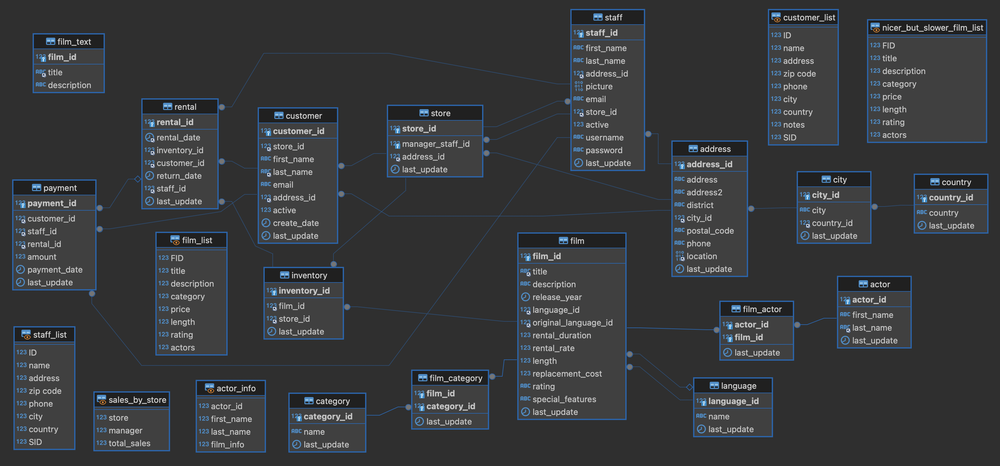

# Evaluación Final del Módulo 2 📊

## Objetivo 🎯

El objetivo de esta evaluación es comprobar la comprensión y habilidades en SQL mediante la resolución de una serie de ejercicios prácticos. Utilizaremos la base de datos Sakila, una base de datos de ejemplo que simula una tienda de alquiler de películas, para realizar consultas y análisis de datos en el contexto de una tienda de alquiler de películas.

## Estructura 🏗️

La base de datos Sakila incluye las siguientes tablas:

1. **actor**: Contiene información sobre los actores, incluyendo su identificador único, nombre, apellido y la fecha de la última actualización.
2. **address**: Almacena direcciones, incluyendo dirección, distrito, ciudad, código postal, teléfono y la fecha de la última actualización.
3. **category**: Contiene categorías de películas, con un identificador único, nombre y la fecha de la última actualización.
4. **city**: Incluye información sobre las ciudades, con un identificador único, nombre, país asociado y la fecha de la última actualización.
5. **country**: Almacena información sobre los países, con un identificador único, nombre y la fecha de la última actualización.
6. **customer**: Contiene información sobre los clientes, incluyendo su identificador único, nombre, apellido, correo electrónico, dirección, estado de actividad y la fecha de la última actualización.
7. **film**: Almacena información sobre las películas, incluyendo título, descripción, año de lanzamiento, idioma, duración del alquiler, tarifa de alquiler, duración, costo de reemplazo, clasificación y características especiales.
8. **film_actor**: Relaciona actores con películas, incluyendo los identificadores de actor y película, y la fecha de la última actualización.
9. **film_category**: Relaciona películas con categorías, incluyendo los identificadores de película y categoría, y la fecha de la última actualización.
10. **film_text**: Contiene el identificador único de las películas, su título y descripción.
11. **inventory**: Contiene información sobre el inventario, incluyendo identificadores de inventario, película y tienda, y la fecha de la última actualización.
12. **language**: Almacena idiomas, con un identificador único, nombre y la fecha de la última actualización.
13. **payment**: Contiene información sobre los pagos, incluyendo identificadores de pago, cliente, personal, alquiler, cantidad y fecha del pago.
14. **rental**: Almacena información sobre los alquileres, incluyendo identificadores de alquiler, fecha de alquiler, inventario asociado, cliente, fecha de devolución, personal y la fecha de la última actualización.
15. **staff**: Contiene información sobre el personal, incluyendo identificador único, nombre, apellido, dirección, imagen, correo electrónico, tienda asignada, estado de actividad, nombre de usuario, contraseña y la fecha de la última actualización.
16. **store**: Almacena información sobre las tiendas, incluyendo identificador único, personal de gestión, dirección y la fecha de la última actualización.

## Diagrama de la Base de Datos Sakila 📜

## Herramientas 🛠️

### DBeaver

[DBeaver](https://dbeaver.io/) es una herramienta de administración de bases de datos que proporciona una interfaz gráfica para interactuar con diversas bases de datos. Es utilizada por desarrolladores y analistas de datos para ejecutar consultas SQL, administrar estructuras de bases de datos y visualizar datos de manera eficiente. En este proyecto, DBeaver se utilizó para conectarse a la base de datos Sakila, escribir y ejecutar consultas SQL, y analizar los resultados de dichas consultas.

#### Características principales de DBeaver:
- **Interfaz de usuario amigable**: Permite una navegación sencilla y visualización clara de las tablas y datos.
- **Compatibilidad**: Funciona con una amplia gama de sistemas de gestión de bases de datos (DBMS) como MySQL, PostgreSQL, Oracle, SQL Server, y más.
- **Funciones avanzadas**: Soporta edición de datos, visualización de esquemas, ejecución de scripts SQL, y generación de informes.

## Temas de SQL Aprendidos 📚

Aquí hay un resumen de los temas que se han aprendido y aplicado:

1. **Sintaxis SQL básica**:
   - **SELECT**: Cómo seleccionar columnas específicas de una tabla.
   - **FROM**: Especificar la tabla de donde se seleccionan los datos.
   - **WHERE**: Filtrar registros basados en condiciones.

2. **Funciones de Agregación**:
   - **COUNT()**: Contar el número de registros.
   - **SUM()**: Sumar valores de una columna.
   - **AVG()**: Calcular el promedio de una columna.
   - **MAX() y MIN()**: Encontrar el valor máximo y mínimo de una columna.

3. **JOINS**:
   - **INNER JOIN**: Combinar filas de dos o más tablas basadas en una condición común.
   - **LEFT JOIN**: Combinar todas las filas de la tabla izquierda y las filas coincidentes de la tabla derecha.
   - **RIGHT JOIN**: Combinar todas las filas de la tabla derecha y las filas coincidentes de la tabla izquierda.
   - **SELF JOIN**: Unir una tabla consigo misma para comparar filas dentro de la misma tabla.

4. **Subconsultas y Consultas Correlacionadas**:
   - **Subconsultas**: Consultas anidadas dentro de otra consulta.
   - **Consultas Correlacionadas**: Subconsultas que se refieren a columnas de la consulta exterior.

5. **Common Table Expressions (CTEs)**:
   - Definición de CTEs usando la cláusula **WITH** para simplificar consultas complejas y mejorar la legibilidad.

6. **Cláusulas de Agrupación**:
   - **GROUP BY**: Agrupar filas que tienen valores en común en columnas específicas.
   - **HAVING**: Filtrar grupos de registros después de aplicar la cláusula GROUP BY.

7. **Ordenación y Limitación**:
   - **ORDER BY**: Ordenar el resultado de una consulta.
   - **LIMIT**: Limitar el número de registros devueltos por una consulta.

### Ejemplos de Análisis realizados con SQL 🔍

#### 1. Selecciona todos los nombres de las películas sin que aparezcan duplicados.
Para obtener los nombres de las películas sin duplicados, se utilizó la cláusula SQL `DISTINCT`.

#### 2. Encuentra el título y la descripción de todas las películas que contengan la palabra "amazing" en su descripción.
Para encontrar películas con la palabra "amazing" en la descripción, se utilizó la cláusula `LIKE`.

#### 3. Encuentra el título de todas las películas que tengan una duración mayor a 120 minutos.
Se obtuvieron los títulos de las películas con una duración superior a 120 minutos utilizando la cláusula `WHERE`.

#### 4. Encuentra los nombres de los actores que tengan un actor_id entre 10 y 20.
Se seleccionaron los nombres de los actores cuyo `actor_id` está comprendido entre 10 y 20 utilizando la cláusula `BETWEEN`.

#### 5. Encuentra el título de las películas en la tabla film que no sean ni "R" ni "PG-13" en cuanto a su clasificación.
Se obtuvieron los títulos de las películas cuya clasificación no es ni "R" ni "PG-13" utilizando la cláusula `WHERE NOT IN`.

#### 6. Encuentra la cantidad total de películas alquiladas por cada cliente y muestra el ID del cliente, su nombre y apellido junto con la cantidad de películas alquiladas.
Se calculó la cantidad total de películas alquiladas por cada cliente, mostrando el ID del cliente, su nombre y apellido, utilizando `COUNT` y `GROUP BY`.

#### 7. Cantidad total de películas alquiladas por categoría
Se utilizó `COUNT`, `INNER JOIN` y `GROUP BY` para calcular la cantidad total de películas alquiladas por cada categoría, mostrando el nombre de la categoría.

#### 8. Promedio de duración de películas por clasificación
Se calculó el promedio de la duración de las películas utilizando `AVG`, `ROUND`, y `GROUP BY` para mostrar el promedio de duración junto con la clasificación.

#### 9. Actores en la película "Indian Love"
Se usó `INNER JOIN`, `WHERE` y `USING` para encontrar el nombre y apellido de los actores que aparecen en la película con título "Indian Love".

#### 10. Películas con palabras clave en la descripción
Se empleó `LIKE` y `OR` para mostrar el título y la descripción de las películas que contienen las palabras "dog" o "cat" en su descripción.

#### 11. Actores no asociados a ninguna película en film_actor
Se utilizó `NOT IN`, `SELECT DISTINCT`, y `WHERE` para identificar actores que no aparecen en ninguna película según la tabla `film_actor`.

#### 12. Películas de la misma categoría que "Family"
Se empleó `LEFT JOIN`, `WHERE` y `ON` para encontrar el título de todas las películas que pertenecen a la misma categoría que la película con nombre "Family".

#### 13. Actores en más de 10 películas
Se utilizó una subconsulta con `INNER JOIN`, `GROUP BY` y `COUNT` para encontrar el nombre y apellido de los actores que han actuado en más de 10 películas.

#### 14. Categorías de películas con promedio de duración superior a 120 minutos
Se utilizó una subconsulta con `INNER JOIN`, `ROUND`, `AVG` y `GROUP BY` para encontrar el nombre de las categorías de películas que tienen un promedio de duración superior a 120 minutos.

#### 15. Actores que han actuado en al menos 5 películas
Se utilizó una subconsulta con `INNER JOIN`, `GROUP BY`, `COUNT` y `ORDER BY` para encontrar el nombre de los actores que han actuado en al menos 5 películas, junto con la cantidad de películas en las que han actuado.

#### 16. Películas alquiladas por más de 5 días
Se utilizó `LEFT JOIN`, `DISTINCT`, y una subconsulta con `WHERE` para encontrar el título de todas las películas que fueron alquiladas por más de 5 días.

#### 17. Actores que no han actuado en películas de la categoría "Horror"
Se utilizó `NOT IN`, una subconsulta con `INNER JOIN` y `WHERE` para encontrar el nombre y apellido de los actores que no han actuado en ninguna película de la categoría "Horror".

#### 18. Películas que son comedias y tienen una duración mayor a 180 minutos
Se utilizó `INNER JOIN`, `WHERE`, y `AND` para encontrar el título de las películas que son comedias y tienen una duración mayor a 180 minutos.

#### 19. Actores que han actuado juntos en al menos una película
Para encontrar los actores que han actuado juntos en al menos una película, se realizó un proceso en varias etapas:

1. **Creación de una doble tabla usando film_actor**: Se realizó un self-join de la tabla `film_actor` consigo misma para obtener las parejas de actores que han trabajado en las mismas películas.

2. **Selección de las parejas de actores y conteo de películas**: Se seleccionaron las parejas de actores y se contó el número de películas en las que han actuado juntos. Se aseguró que el `actor_id` de la primera tabla (`fa1`) fuera menor que el `actor_id` de la segunda tabla (`fa2`) para evitar duplicados.

3. **Uso de una CTE (Expresión de Tabla Común)**: Se utilizó una CTE llamada `actor_pairs` para almacenar el resultado de la consulta anterior, que contiene las parejas de actores y el recuento de películas en las que han actuado juntos.

4. **Consulta final**: Se realizó un join con la tabla `actor` dos veces para obtener el nombre completo de cada actor en las parejas. Se ordenó el resultado por el número de películas en las que han actuado juntos en orden descendente.

Estas preguntas fueron contestadas mediante consultas SQL que demuestran el dominio de diversas técnicas y funciones avanzadas de SQL, incluyendo la manipulación y consulta de datos, la utilización de subconsultas y la ejecución de operaciones de agregación y filtrado.